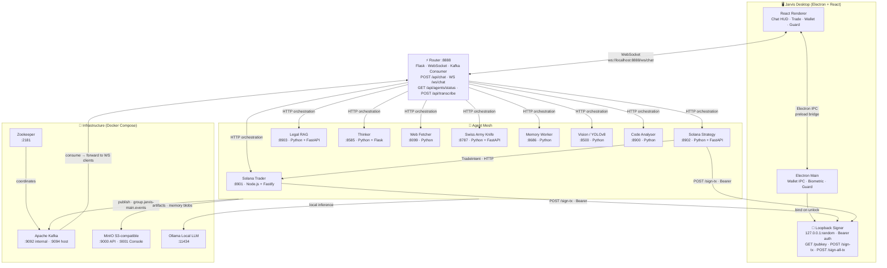
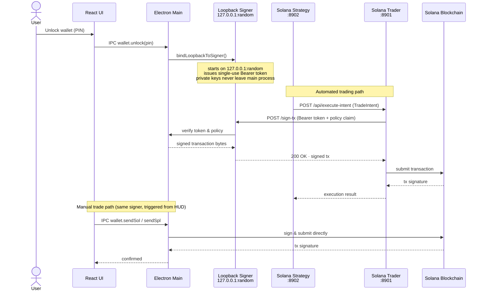
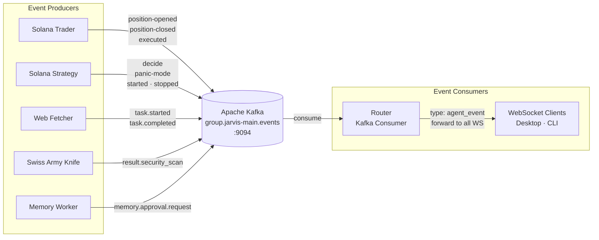

# Jarvis

**Your personal AI that trades Solana, researches the web, guards your laptop, and remembers everything — secured by Touch ID and running entirely on your machine.**

> Most AI tools make you dependent on someone else's cloud, someone else's servers, and someone else's rules. Jarvis is different. It lives on your computer, talks to you in plain language, and actually does things — it executes trades, reads contracts, watches your camera, writes research reports, and gets smarter with every conversation. You're not renting intelligence. You own it.


---

## Overview

Jarvis turns your Mac into a sovereign AI workstation. Unlock it with your fingerprint, talk to it like a person, and watch it execute — swapping tokens on Solana, deep-diving research topics, reviewing your code, watching your camera for intruders while you're away, and building memory across every session.

**Everything runs locally.** Your private keys never touch a server. Your conversations stay on your machine. You get the power of a full AI agent stack without handing your data to anyone.

### What Jarvis can do

- **Trade Solana** — swap any token via Jupiter, launch tokens on Pump.fun, or let the AI strategy engine trade autonomously with a budget you set and a panic-sell watchdog standing by
- **Research anything** — a 9-phase research pipeline crawls the web, synthesises findings, and produces structured reports on any topic you throw at it
- **Guard your laptop** — activate guard mode when you step away; the camera detects intruders and sounds an alarm, locking the screen until you verify with biometrics
- **Answer legal questions** — drop in any PDF or contract and ask questions in plain language; Jarvis reads and cross-references the documents for you
- **Review your code** — paste a repo or file and get a security and quality analysis in seconds
- **Remember everything** — episodic memory means Jarvis recalls past conversations, decisions, and context across sessions, getting more useful the longer you use it

---

## Architecture

### System Overview



### Transaction Signing Flow



### Kafka Event Bus



---

## Subsystems

| Service | Port | Tech | Role |
|---------|------|------|------|
| **Desktop** | — | Electron 39 + React 19 + TypeScript | Native UI, wallet vault, biometric auth, guard mode |
| **CLI** | — | Bun + React Ink + TypeScript | Terminal interface, WebSocket client |
| **Router** | 8888 | Python + Flask + aiohttp | Central orchestrator, WebSocket gateway, Kafka consumer |
| **Solana Trader** | 8901 | Node.js + Fastify + Solana Agent Kit v2 | On-chain execution: swap, transfer, Pump.fun launch |
| **Solana Strategy** | 8902 | Python + FastAPI | AI strategy engine, automated trading loop, watchdog, panic-sell |
| **Legal RAG** | 8903 | Python + FastAPI + RAG | PDF/text ingestion, vector search, legal Q&A |
| **Thinker** | 8585 | Python + Flask | 9-phase autonomous research pipeline → paper generation |
| **Web Fetcher** | 8099 | Python + Kafka | Web crawling, content extraction, Kafka consumer |
| **Swiss Army Knife** | 8787 | Python + FastAPI | Network tools, security scanning, utility functions |
| **Vision** | 8500 | Python + YOLOv8 | Image recognition, object detection, guard-mode analysis |
| **Code Analyser** | 8900 | Python | Static analysis, security review |
| **Memory Worker** | 8686 | Python | Episodic memory, Mem0 semantic memory, approval queue |
| **Kafka** | 9092/9094 | Apache Kafka + Zookeeper | Async event bus between all agents |
| **MinIO** | 9000/9001 | MinIO (S3-compatible) | Artifact + memory blob storage |
| **Ollama** | 11434 | Ollama | Local LLM inference |

---

## Connection Protocol Reference

| Layer | Protocol | Endpoint | Direction | Purpose |
|-------|----------|----------|-----------|---------|
| UI ↔ Router | WebSocket | `ws://localhost:8888/ws/chat` | bidirectional | Streaming status updates + final AI response |
| Router ↔ Agents | HTTP | `http://localhost:{port}/api/...` | Router → Agent | Synchronous task orchestration |
| Agent events | Kafka | `localhost:9094` · topic `group.jarvis-main.events` | all agents → broker | Lifecycle events forwarded to WS clients |
| Desktop ↔ Main | Electron IPC | `wallet.*`, `biometric-verify`, `guard-*` channels | renderer ↔ main | Preload bridge (contextIsolation=true) |
| Agent ↔ Signer | HTTP loopback | `http://127.0.0.1:<random>` · Bearer token | solana-trader/strategy → main | Transaction signing — private keys never leave the process |
| Artifact storage | MinIO S3 API | `http://localhost:9000` | agents → MinIO | Research outputs, memory blobs |
| Local inference | HTTP | `http://localhost:11434` | agents → Ollama | Local LLM (non-cloud path) |
| Strategy → Trader | HTTP | `http://localhost:8901/api/execute-intent` | strategy → trader | Execute `TradeIntent` generated by strategy engine |

### WebSocket Message Types

| `type` | Direction | Payload |
|--------|-----------|---------|
| `status` | server → client | `{ text }` — live processing updates |
| `response` | server → client | `{ text, tools_used, findings, report, emotion, duration_ms }` |
| `error` | server → client | `{ text }` |
| `alarm` | server → client | guard-mode intrusion alert |
| `agent_event` | server → client | raw Kafka lifecycle event forwarded to UI |

### Loopback Signer Routes

| Method | Route | Auth | Purpose |
|--------|-------|------|---------|
| `GET` | `/pubkey` | Bearer | Return wallet public key |
| `GET` | `/health` | Bearer | Unlock status check |
| `POST` | `/sign-tx` | Bearer + policy claim | Sign single transaction |
| `POST` | `/sign-all-tx` | Bearer + policy claim | Sign transaction batch |

---

## Port Quick-Reference

| Port | Service |
|------|---------|
| 8888 | Router (HTTP + WebSocket) |
| 8901 | Solana Trader |
| 8902 | Solana Strategy |
| 8903 | Legal RAG |
| 8900 | Code Analyser |
| 8787 | Swiss Army Knife |
| 8686 | Memory Worker |
| 8585 | Thinker |
| 8500 | Vision |
| 8099 | Web Fetcher |
| 9092 | Kafka (internal) |
| 9094 | Kafka (external/host) |
| 2181 | Zookeeper |
| 9000 | MinIO API |
| 9001 | MinIO Console |
| 11434 | Ollama |

---

## Getting Started

### Prerequisites

- macOS (biometric auth), or Linux/Windows (biometric skipped automatically)
- Docker + Docker Compose
- Node.js 20+ and Bun (for CLI)
- Python 3.11+ (for agents, if running natively)

### 1. Start infrastructure

```bash
docker compose up -d   # Kafka, Zookeeper, MinIO, Ollama
```

### 2. Launch

```bash
# Desktop app (Electron)
./run_local.sh --ui desktop

# Terminal CLI
./run_local.sh --ui cli

# Headless (no UI, agents only)
./run_local.sh
```

The launcher script starts all agents natively (not in Docker) so they can access the host network directly, then connects them to the Dockerised Kafka broker on port 9094.

### 3. First run

1. App opens to the **Jarvis welcome screen** — Touch ID / biometric prompt
2. Create a **wallet vault** (generate fresh seed phrase, or import existing)
3. Set a **PIN** (encrypts the vault on disk)
4. Enter the **Chat HUD** — all agents are now reachable

### Desktop build

```bash
cd desktop
npm run build:mac     # macOS universal
npm run build:win     # Windows
npm run build:linux   # Linux
```

---

## Project Structure

```
Jarvis/
├── desktop/                  # Electron app (React + TypeScript)
│   ├── src/main/             # Main process: wallet IPC, biometric, guard, loopback signer
│   ├── src/renderer/src/     # React UI: pages, hooks, styles, assets
│   └── src/preload/          # IPC bridge + guard overlay preload
├── agent/
│   ├── router/               # Central orchestrator :8888
│   ├── solana-trader/        # On-chain execution :8901
│   ├── solana-strategy/      # Strategy engine + auto-trader :8902
│   ├── legal-rag/            # Legal document RAG :8903
│   ├── thinker/              # Research pipeline :8585
│   ├── web_fetcher/          # Web crawling :8099
│   ├── swiss-army-knife/     # Utilities + network tools :8787
│   ├── vision/               # YOLOv8 vision :8500
│   ├── code-analyzer/        # Static analysis :8900
│   └── memory/               # Episodic + semantic memory :8686
├── cli/                      # Bun + React Ink terminal interface
├── docker-compose.yml        # Kafka, MinIO, Zookeeper, Ollama
├── run_local.sh              # Dev launcher (--ui desktop|cli)
└── build-desktop.sh          # Desktop production build script
```

---

## Recent Updates

| Date | Change |
|------|--------|
| May 2026 | **Jarvis branding** — hexagonal SVG logo, branded welcome screen with animated status dot, app name set to "Jarvis" across OS (dock, menu bar, about panel) |
| May 2026 | **Legal RAG agent** — PDF/TXT ingestion, vector search, SSE progress, legal Q&A panel in Chat HUD |
| May 2026 | **Solana wallet + automated trading** — encrypted vault, PIN auth, Jupiter swap, Pump.fun launch, strategy engine with watchdog and panic-sell |
| May 2026 | **Code analyser + guard mode** — YOLOv8 camera-based intrusion detection, keyboard/mouse lock overlay |
| May 2026 | **Biometric authentication** — Touch ID / Face ID on entry, biometric-gated wallet operations |
